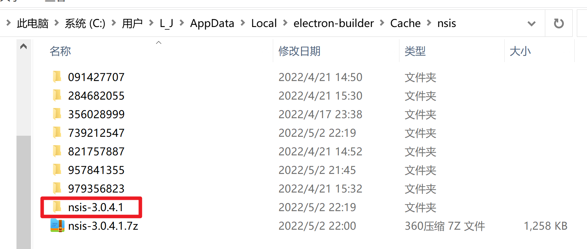

* Do not use "@ts-ignore" because it alters compilation errors  @typescript-eslint/ban-ts-comment

```
'@typescript-eslint/ban-ts-ignore': 'off',
'@typescript-eslint/ban-ts-comment': 'off',
```


* 存储方案
  [sindresorhus/electron-store: Simple data persistence for your Electron app or module - Save and load user preferences, app state, cache, etc](https://github.com/sindresorhus/electron-store)
  [Electron存储简单数据和用户首选项推荐用electron-store](https://xushanxiang.com/electron-store.html)
  

* [Mock.js](http://mockjs.com/examples.html)

* ? 怎么更换图标?

使用 --config 指定配置后, package.json>main 需要改成 `"main": "dist_electron/bundled/background.js",`

[PNG转ICO图标格式 - 在线，免费，快速](https://png2icojs.com/zh/)

* Vue CLI Plugin Electron Builder

[Configuration | Vue CLI Plugin Electron Builder](https://nklayman.github.io/vue-cli-plugin-electron-builder/guide/configuration.html#table-of-contents)
To see available options, check out Electron Builder Configuration Options([Common Configuration - electron-builder](https://www.electron.build/configuration/configuration))


*  ⨯ Get "https://github.com/electron-userland/electron-builder-binaries/releases/download/nsis-3.0.4.1/nsis-3.0.4.1.7z": read tcp 192.168.31.52:10154->140.82.114
   .3:443: wsarecv: A connection attempt failed because the connected party did not properly respond after a period of time, or established connection failed becaus
   e connected host has failed to respond.

A: 手动下载放到目录下([打包成安装包错误，下载不来winCodeSign · Issue #26 · trazyn/weweChat · GitHub](https://github.com/trazyn/weweChat/issues/26))


* `codemirror-editor-vue3` 代码提示配置

1. options
```
hintOptions: {
    completeSingle: false,
    alignWithWord: false,
    hint: getHints, // 返回代码提示的结构. list,from,to
}
```
2. onMounted
```
onMounted(() => {
  // cminstance 拿到原始 cm 对象
  let editor = cm1Ref.value.cminstance;
  console.log("---------onMounted-----", editor);
  // //代码自动提示功能，记住使用cursorActivity事件不要使用change事件，这是一个坑，那样页面直接会卡死
  editor.on('inputRead', function () {
    editor.showHint()
  })
})
```

[(74条消息) 实现codemirror的自定义提示的功能_maya1024的博客-CSDN博客_codemirror代码提示](https://blog.csdn.net/high32/article/details/117049672)
[CodeMirror代码提示功能 - 掘金](https://juejin.cn/post/6844904013180174343)
[codeMirror_dome/HelloWorld.vue at master · mingju0421/codeMirror_dome · GitHub](https://github.com/mingju0421/codeMirror_dome/blob/master/src/components/HelloWorld.vue)
